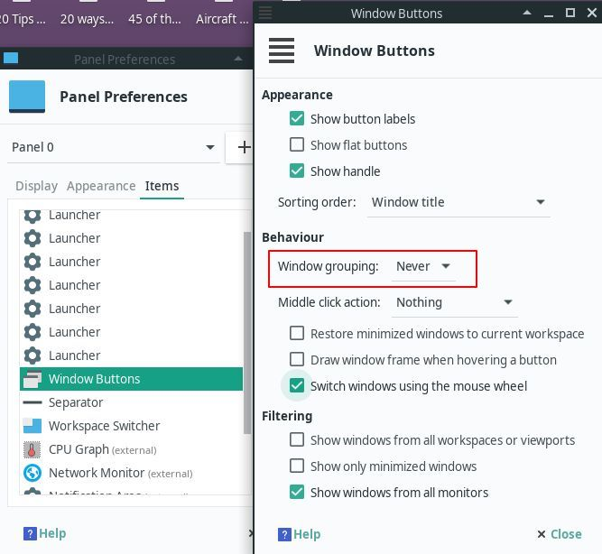

# Manjaro software installation guide

I shall write a short tutorial on it soon.

My own guide to install softwares on Manjaro Linux

### Switch to Fastest Mirror

```
sudo pacman-mirrors --fasttrack
```

### Update Manjaro
```
sudo pacman -Syyu
```

### Install AUR package manager
```
sudo pacman -S yaourt
```

### Enabling AUR in Manjaro


## Install Vim Editor
```
sudo pacman -S vim
```

In case if you get any error while installing the package, try the command below and repeat the previous commands:
```
sudo pacman -Rs vim
```

## Install XnView Multi Platform

Install from "Add/Remove Software" app using AUR.

## XnView Settings

```
General
	General
	- Startup
		- Uncheck "Open browser"
		- Startup directory: None
		- Mode when starting with a file: Normal
	
Interface
	Keyboard
		Pressing ESC once quits XnViewMP: Always

Browser
	Catalog
		Catalog
			Enable Catalog: Untick
```

## Archive Software (RAR, ZIP, etc)

Open "Add/Remove Software" app and search for "peazip-gtk2" from AUR repository. Build from the search result.
```
peazip-gtk2 (GTK2 archiver utility)
Repository: AUR
size: 20.7 MB
```
# Color Picker

Search "pick-color-picker" in "Add/Remove Software" having AUR selected. Build the app from the search result.

# Filezilla

Install using "Add/Remove Software"

# dflux
"xflux" changes monitor color temperature adaptively to ease eye strain.

### fluxgui
Better lighting for Linux. Open source GUI for xflux.

- Install using "Add/Remove Software" feature using AUR.
- After completing installation, you should see "f.lux indicator applet". Click on it. This little app's icon should appear in the panel (like, Windows's taskbar). Right-click on it, and choose Preferences. In this screen, choose your desired color temperature. Finally check the "Autostart f.lux indicator applet" to start automatically when Manjaro starts.

# Nikon RAW .NEF Driver

To open Nikon's RAW .NEF files in GIMP, install a software, "Darktable". It installs a driver that enables .NEF files to be open by GIMP

```
sudo pacman -S darktable
```

## Install traceroute

```
sudo pacman -S traceroute
```

In case if you get any error while installing the package, try the command below and repeat the previous commands
```
sudo pacman -Rs traceroute
```
## Disable Windows Grouping



- Click "Start" button and search for "Panel" and click on it to start panel customization app.
- Select the "Items" tab.
- From the list window, select "Windows Buttons" and edit it.
- Under "Behavior" section, Select "Never" for "Windows Grouping".
- Close the windows all the way down to get out the Penel windows.
